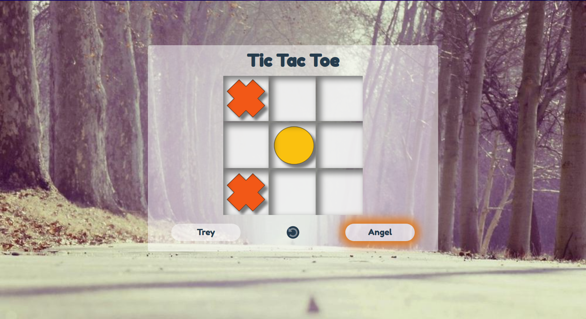

# Tic Tac Toe

> This is a DOM Tic Tac Toe app where users can play the classic [Tic Tac Toe](https://en.wikipedia.org/wiki/Tic-tac-toe) game.

## Built With

- JavaScript, HTML & CSS

## Live Demo

[Live Demo Link](https://jstictactoe.netlify.app/)

## Getting Started

To get a local copy up and running follow these simple example steps.

To get a local copy up and running follow these simple example steps.
- git clone git@github.com:aecordova/js-tictactoe.git

Then you browse to the folder and exucute the following commands
- cd js-tictactoe
- double click on the index.html file to open the game in your browser.

### Instructions:
- Click the New Game button to start the game.
- Click on the rest button to  restart the current game.
- Click on the Player pills to enter player names.
- The application will highlight the player to make the next move.
- To make a move, click on the desired box/square.
- The app will display the result once the game is over with either a winner or a draw result.
- Click on Play Again to start a new game.

## Authors

👤 **Treasure Kabareebe**

- Github: [@trekab](https://github.com/trekab)
- Twitter: [@TKabareebe](https://twitter.com/TKabareebe)
- Linkedin: [Treasure Kabareebe](https://www.linkedin.com/in/treasure-kabareebe/)

👤 **Angel Cordova** 

- Github: [@aecordova](https://github.com/aecordova) 
- Linkedin: [Angel Cordova](https://www.linkedin.com/in/ae-cordova/)

## 🤝 Contributing

Contributions, issues and feature requests are welcome!

Feel free to check the [issues page](issues/).

## Show your support

Give a ⭐️ if you like this project!

## Acknowledgments

- Hat tip to anyone whose code was used
- Inspiration
- etc

## 📝 License

This project is [MIT](lic.url) licensed.